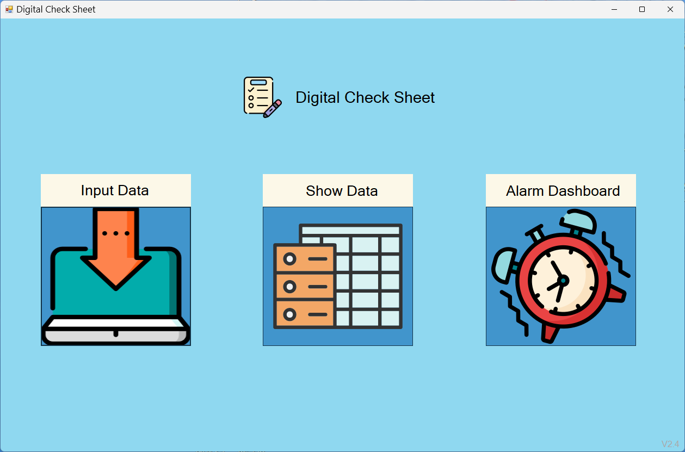
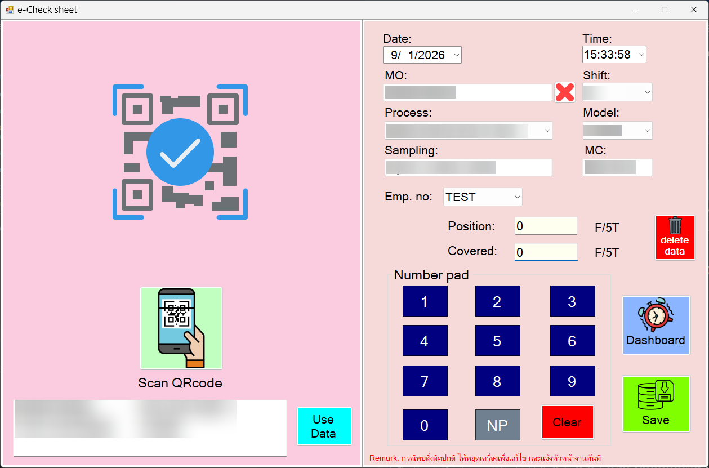
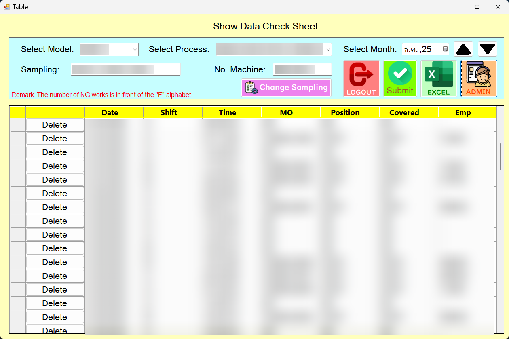
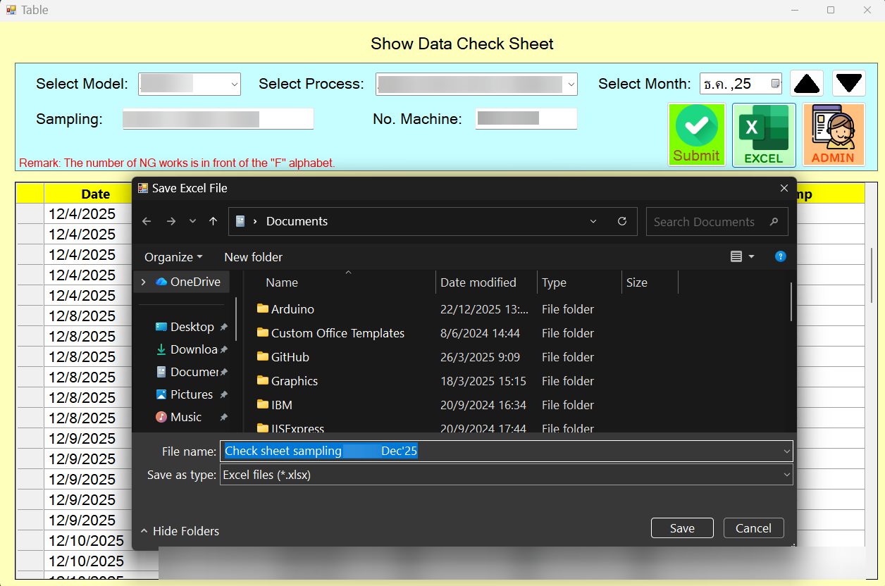
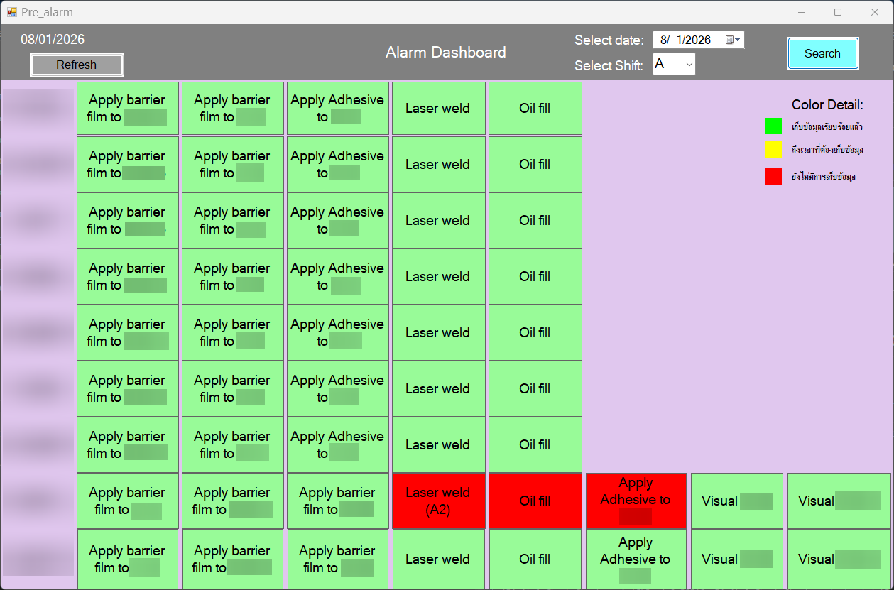

# Checksheet Program

## 📌 Project Overview
&emsp; This project is built to help with Quality Control (QC) in recording sampling data. This ensures that the products meet the required quality standards and confirms that machines are operating without error or causing defects. The program is designed to be used on a tablet (Surface Go 4), making it convenient to walk around the production line and collect data for each process.

### 🔒 Note on Source Code
> **Disclaimer:**
> This project was developed professionally for a private client / company.
> Due to Non-Disclosure Agreements (NDA) and proprietary rights, the **source code cannot be made public**.
> This repository serves as a **showcase** of the application's functionality, UI design, and my technical contributions.

---

## 📸 Screenshots & Demo

### 1. Main menu page

*Description: The main menu for selecting the function.*

### 2. Input data page

*Description: A page to input the details of the sampling results. It supports opening the camera to scan QR codes for reading and using data automatically.*

### 3. Show data page

*Description: Displays all collected data. Users can filter by model, process, and month. This page includes a user authorization system (Login) to allow editing or deleting data in case of mistakes.*

#### 3.1 Export to excel file

*Description: Users can export data to an Excel file to view monthly reports. The file contains sampling data for every process of the selected model.*

### 4. Alarm Dashboard page

*Description: Data Collection Compliance Dashboard.

If a process is missing data, a red button or yellow will be  appear. Clicking this button links directly to the input page, making it easy to fill in the information. When the program starts, it opens this dashboard first to show any overdue tasks.*

---

## 🎯 Objectives

* **Check Machine Condition:** To verify and monitor machine conditions to ensure production stability and prevent defects throughout the manufacturing process.

* **Reduce NG Workflow:** To minimize the occurrence of the non-conforming (NG) products caused by machine malfunctions or technical errors.

* **Data Digitalization:** To transform manual data recording and reporting into an automated system, enhancing data accuracy, integrity, and full traceability.

---

## 🏆 Benefits & Business Impact

* **Increased Efficiency:** Eliminates the need for paper checklists, allowing QC staff to work faster and more conveniently with tablets.

* **Reduce Human Error:** Reduces human error by using QR code scanning instead of manual typing.

* **Data Management:** All data is stored centrally in a database, making it easy to generate reports and analyze trends without searching through the paper.

---

## 🖧 Flow diagram

---
---
---
---
---
---
---

## ✨ Key Features

* **Tablet-Optimized QR Scanner:** Integrates with the device's camera to scan and extract data, eliminating manual typing and reducing human error.
* **Alarm Dashboard:** Automatically detects and highlights missing sampling data. Includes a direct shortcut to the input page.
* **Role-Based Access Control (RBAC):** Secures historical data modification (edit/delete) behind an authentication system, allowing only authorized personnel to make changes.
* **Automated Excel Reporting:** Exports filtered sampling data into monthly Excel reports for review and quality analysis.

---

## 🗄️ Database Architecture

### 🧩 Diagram

*Description: ER Diagram for the Master Check System.*

### 🚀 Performance & Scalability features
* **Stored Procedures:** Migrated complex logic to the server side to minimize network traffic.

### 🔒 Security Implementation
* **Dedicated Database User:** Avoided using the `sa` (System Admin) account by creating a dedicated user account specifically for the application's connection.
* **Least Privilege Principle:** Restricted database permissions to essential CRUD Operations (Create, Read, Update, Delete) only, preventing unauthorized changes to the table structures or schema.
* **Stored Procedure Access:** Managed data access primarily via EXECUTE permissions on Stored Procedures to hide table structure and prevent SQL Injection risks.

---

## 🛠 Tech Stack
* **Language:** C#
* **Framework:** .NET Framework / Windows Forms
* **Database:** Microsoft SQL Server (MSSQL)
* **Tools:** Visual Studio, Git

---

## 💡 Technical Challenges & Solutions
* **Challenges:**
    * Controlling the camera on the tablet.
    * Ensuring the correctness of data patterns exported to Excel for all processes in a model.
    * Retrieving data from the database for the dashboard, considering that each model has different data collection schedules.
* **Solutions:** 
    * Used the **AForge** library to help manage camera functions (on/off) and the **ZXing** library to convert QR Codes into text.
    * Wrote specific SQL Queries to verify each part of the data before combining them (using transaction) for display or export.

---

## 📬 Contact Me
* **Name:** Pawarade Liangkobkij
* **Email:** l.pawarade@gmail.com